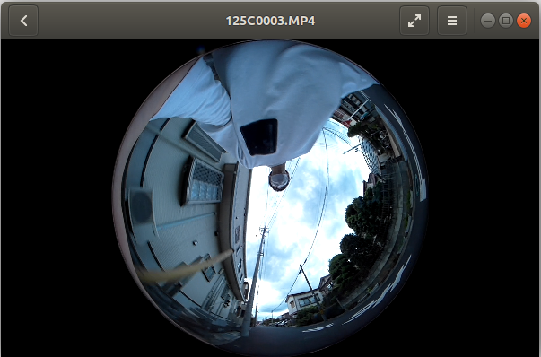
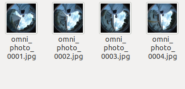
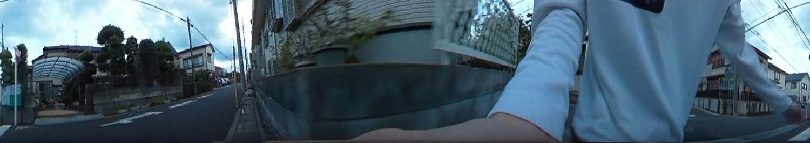

# video_to_Image
<<<<<<< HEAD

## Install dependent package
```
pip install install ffmpeg-python
```

## Usage
* Making panorama image
```
python create_photo_linear.py {video_file.mp4} {save folder} {sec of dividing}
```

* Making omunidirectional image
```
python create_photo_omni.py {video_file.mp4} {save folder} {sec of dividing}
```

## Example1
```
python create_photo_omni.py ./video/125C0003.MP4 photo/ 1
```

<div style="text-align: center">

<br>

<span style="font-size:200%; color:red;">⬇</span>


</div>

## Example2
```
python create_photo_linear.py ./video/125C0003.MP4 photo/ 1
```

<div style="text-align: center">

<br>

<span style="font-size:200%; color:red;">⬇</span>


</div>


=======
'''
pip install mpeg-4
'''
>>>>>>> origin/main
